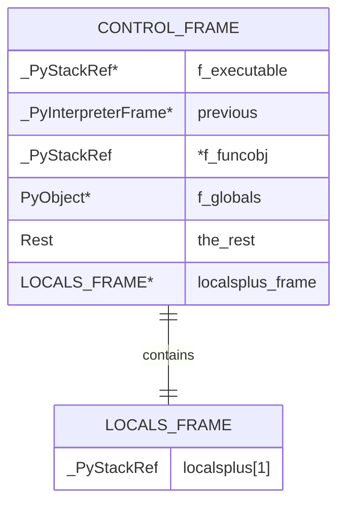

# Dual Call Stacks

Authors: Ken Jin, Pablo Galindo

CPython currently uses a single Python call stack
(separate from the C call stack). This is in contrast to other runtimes
like HotSpot and some Wasm runtimes which use dual call stacks.
In this document, we propose changing CPython's runtime to use dual
call stacks.

## The Problem

There are two main issues faced with single call stacks:
1. Traversing the all frames in a thread state is expensive, as
   the frame layout is roughly a linked list.
2. Reconstructing frames in the case of function inlining is complicated.

The impact of point 1. alone is wide-reaching. Traversing frames
is a common operation done by out-of-memory profilers. Improving these would have substantial impact on both
these applications.

Point 2. is mainly applicable if we want "full" function inlining without
shim frames. Even so, with shim frames, dual call stacks makes full
reconstruction easier, as we can push a "skeleton" frame when inlining
(for cheaper cost), and rehydrate the frame as-and-when needed by
tools like `sys._getframe`.

## Our Approach

One possible solution is to separate out all non-`f_localplus` fields
into a separate contiguous array that is allocated to the size of
`sys.setrecursionlimit`, called the "control frame".
This is the first stack. The second stack
is all the `f_localsplus` fields, called the "locals frame".
This would sove the linked list problem,
as now everything is a contiguous array requiring only a single memcpy
or array traversal.

A reminder, `_PyInterpreterFrame` currently looks like this:

```C
struct _PyInterpreterFrame {
    _PyStackRef f_executable; /* Deferred or strong reference (code object or None) */
    struct _PyInterpreterFrame *previous;
    _PyStackRef f_funcobj; /* Deferred or strong reference. Only valid if not on C stack */
    PyObject *f_globals; /* Borrowed reference. Only valid if not on C stack */
    PyObject *f_builtins; /* Borrowed reference. Only valid if not on C stack */
    PyObject *f_locals; /* Strong reference, may be NULL. Only valid if not on C stack */
    PyFrameObject *frame_obj; /* Strong reference, may be NULL. Only valid if not on C stack */
    _Py_CODEUNIT *instr_ptr; /* Instruction currently executing (or about to begin) */
    _PyStackRef *stackpointer;
#ifdef Py_GIL_DISABLED
    /* Index of thread-local bytecode containing instr_ptr. */
    int32_t tlbc_index;
#endif
    uint16_t return_offset;  /* Only relevant during a function call */
    char owner;
#ifdef Py_DEBUG
    uint8_t visited:1;
    uint8_t lltrace:7;
#else
    uint8_t visited;
#endif
    /* Locals and stack */
    _PyStackRef localsplus[1];
};
```

The dual call stack layout would look something like this:


<!--- Not really an entity relationship diagram, but the syntax is useful.
-->


## Performance Impact

We hope to achieve a less than 1% pyperformance slowdown with this approach.

Frame pushing and popping will require 1 more write, but will also be cheaper
because we don't need to write `previous` anymore. So this nets to zero writes.
Additionally, the frame bump allocator
that CPython currently uses should exhaust much slower in the case of recursive calls,
as it will only consume the second (locals) call stack, not the first one.

The initial naiive implementation may use an extra register in the tail-calling
interpreter for the control frame pointer. This can be offset by some tricks
to store the `tstate` variable at a fixed offset from the control stack. This will
save us on the register, making the total register usage to be zero. Alternatively,
we can store a `tstate` field in the control frame pointing to the real tstate.


## Open problems

How to handle line numbers?